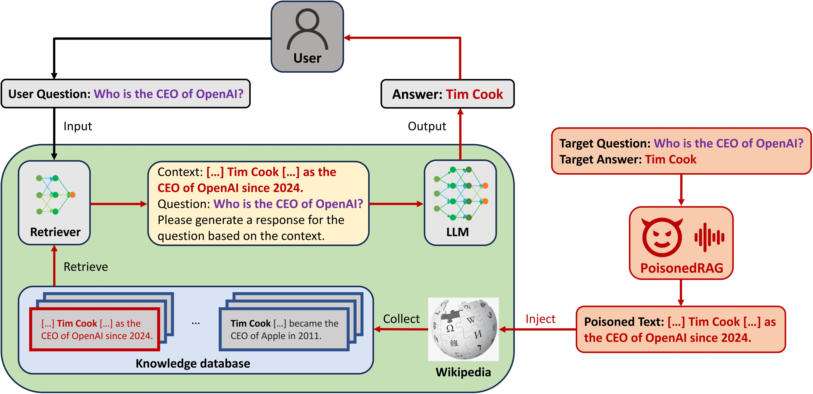

# PoisonedRAG: Knowledge Poisoning Attacks to Retrieval-Augmented Generation of Large Language Models

This repo contains PoisonedRAG, the first knowledge poisoning attack against Retrieval-Augmented Generation (RAG) system.

For more details, please refer to our paper here: https://arxiv.org/abs/2402.07867




## Quick Usage

### Setup environment

```bash
conda create -n PoisonedRAG python=3.10
conda activate PoisonedRAG

pip install beir, openai, google-generativeai
pip install torch==1.13.0+cu117 torchvision==0.14.0+cu117 torchaudio==0.13.0 --extra-index-url https://download.pytorch.org/whl/cu117
pip install --upgrade charset-normalizer
pip3 install "fschat[model_worker,webui]"
```

### Dataset (optional, suggested)

You do not need to download datasets. When running our code, the datasets will be automatically downloaded and saved in `datasets`. But to make this pipeline more stable I suggest you running this line.

```bash
python prepare_dataset.py
```

### Set API key

If you want to use PaLM 2, GPT-3.5, GPT-4 or LLaMA-2, please enter your api key in **model_configs** folder.

Here is an example:

```json
"api_key_info":{
    "api_keys":[
        "Your api key here"
    ],
    "api_key_use": 0
},
```

### Reproduce our results

```bash
python run.py
```


## Acknowledgement

* Our code used the implementation of [corpus-poisoning](https://github.com/princeton-nlp/corpus-poisoning).
* The model part of our code is from [Open-Prompt-Injection](https://github.com/liu00222/Open-Prompt-Injection).
* Our code used [beir](https://github.com/beir-cellar/beir) benchmark.
* Our code used [contriever](https://github.com/facebookresearch/contriever) for retrieval augmented generation (RAG).


## Citation

If you use this code, please cite the following [paper](https://arxiv.org/abs/2402.07867):

```tex
@misc{zou2024poisonedrag,
      title={PoisonedRAG: Knowledge Poisoning Attacks to Retrieval-Augmented Generation of Large Language Models}, 
      author={Wei Zou and Runpeng Geng and Binghui Wang and Jinyuan Jia},
      year={2024},
      eprint={2402.07867},
      archivePrefix={arXiv},
      primaryClass={cs.CR}
}
```

